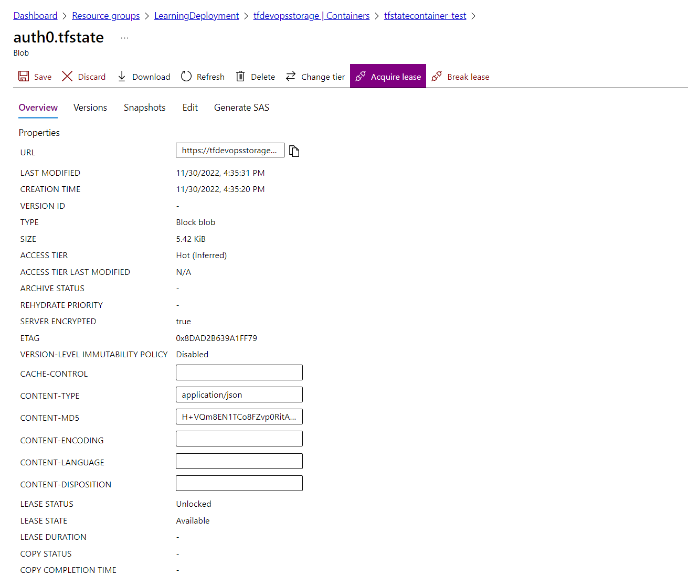
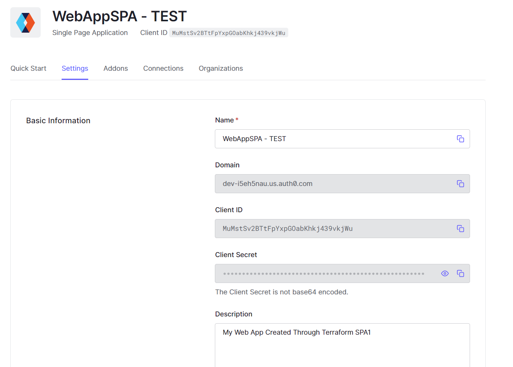

# Auth0 Management with Terraform
+ Manage Auth0 Configuration with Terraform
+ Store Terraform state files to Azure Storage
+ Using GitHub Actions for deployment

## Requirements
### Create an account Auth0
    - Add them into secret GitHub: AUTH0_CLIENT_ID & AUTH0_CLIENT_SECRET

### Azure Storage
+ Create Azure Account and Storage
    ```
    # Create Resource Group
    az group create -n LearningDeployment -l koreacentral

    # Create Storage Account
    az storage account create -n terraformstorageauth0 -g LearningDeployment -l koreacentral --sku Standard_LRS

    # Create Storage Account Container
    az storage container create -n tfstatecontainer-test --account-name terraformstorageauth0 --auth-mode login
    ```

+ Create credentials
    ```
    az ad sp create-for-rbac --name tfserviceprincipal
    ```
    Add them into secret GitHub
    - password ==> AZURE_AD_CLIENT_SECRET
    - appId ==> AZURE_AD_CLIENT_ID
    - tenant ==> AZURE_AD_TENANT_ID
    - AZURE_SUBSCRIPTION_ID --> subscription of resource group

+ Update $subcription_id and set role for service principal
    ```
    ./role.ps1
    ```


### Usage
+ Create a Machine to Machine application in Auth0
+ You'll need to authorize your new app to call the Auth0 Management API.
+ Select it in the dropdown and then authorize all scopes
+ Open the Settings tab and copy the Domain, Client ID, and Client Secret values - you'll need them in the next step for configuring the Auth0 Provider.

+ Pipeline:
    Test: has Output
    Stage: NOT Output

### Results
+ Terraform State File Store in Azure
    

+ Auth0 Single Page Application
    

### References
+ [Manage Your Auth0 Configuration](https://auth0.com/blog/use-terraform-to-manage-your-auth0-configuration/)
+ [Setting up Auth0 with Terraform](https://hceris.com/setting-up-auth0-with-terraform/)
+ [Push Terraform State File to Azure using GitHub Action](https://thomasthornton.cloud/2021/03/19/deploy-terraform-using-github-actions-into-azure/)
+ [Remote Backend State with Terraform and Azure Storage](https://www.ciraltos.com/remote-backend-state-with-terraform-and-azure-storage/)
+ [Multi environments Azure Deployment with Terraform and GitHub Action ](https://dev.to/pwd9000/multi-environment-azure-deployments-with-terraform-and-github-2450)
